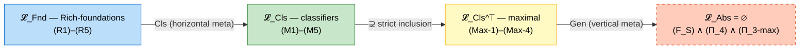

# MSFS — The Moduli Space of Formal Systems

*The Moduli Space of Formal Systems: Classification, Stabilization, and a No-Go Theorem for Absolute Foundations.*

Max Sereda, 2026 · [Zenodo DOI 10.5281/zenodo.19755781](https://doi.org/10.5281/zenodo.19755781) · 44 pages · 65 structural results (21 definitions, 7 lemmas, 20 theorems, 9 corollaries, 6 propositions, 2 conventions) · every result machine-checked in the [Verum corpus](./verum-corpus/)

## The question this work changes

For over a century the foundational debate has been shaped by one question: *which formal system is the correct foundation of mathematics?* Set theorists, type theorists, category theorists and constructivists each held a candidate; none could win, because — as it turns out — the question itself was aimed at an empty target.

MSFS replaces the question. Instead of asking *which foundation is correct*, it asks:

> **What is the structure of the space of all coherent foundations — and where is its edge?**

This is the same move Riemann made with geometry: stop asking *which geometry is true* and study the space of all geometries. Once the move is made, both halves of the new question receive formal answers: four theorems describe the **interior** of the space, and one boundary theorem (AFN-T) proves that its would-be summit — the *absolute* foundation — **does not exist**.

Concretely: the totality of formal foundations is treated as a single categorical object, the moduli space $\mathfrak{M}$ — the classifying $(\infty, 2)$-stack whose points are Morita-equivalence classes of *Rich foundations* (formal theories satisfying conditions (R1)–(R5)) and whose morphisms are faithful interpretations and provable natural equivalences. Disputes about interpretability stop being philosophy and become morphisms.

## Historical position

The plurality is real: Zermelo–Fraenkel set theory (1908–1922), von Neumann–Bernays–Gödel class theory (1925–1940), Lawvere's ETCS (1964), Martin-Löf type theory (1984), the Calculus of Inductive Constructions (1988), Homotopy Type Theory (2005+), cubical HoTT (2015+), $(\infty, 1)$-topos theory (Lurie 2009), noncommutative geometry (Connes 1994), cohesive higher topos theory (Schreiber 2013). Each is formally coherent; each interprets substantial fragments of classical mathematics; none has privileged status.

Parallel to this plurality, a line of structural impossibility results accumulated: **Cantor 1891** (absolute infinity), **Russell 1903** (universal class), **Gödel 1931** (incompleteness), **Tarski 1936** (undefinability of truth), **Lawvere 1969** (fixed-point diagonal), **Feferman 2013 / Ernst 2015** (unlimited category theory). Each closes one specific route to an absolute foundation; together they sketch a pattern **without naming it**.

MSFS names the pattern: the classical no-go results are specializations of **one structural obstruction at the outer boundary of $\mathfrak{M}$**.

## The picture: a library, its catalogues, and an empty floor

The space of foundations is stratified — not by *strength*, but by **role**:

- **Foundations** ($\mathcal{L}_{\mathrm{Fnd}}$) *write the books*: ZFC, HoTT, CIC generate mathematics from their axioms.
- **Classifiers** ($\mathcal{L}_{\mathrm{Cls}}$) *are the catalogues*: meta-frameworks (∞-cosmoi, Univalent Foundations, the cohesive framework) that organize the foundations without writing a single book — classification is parametric, never generative.
- **Maximal classifiers** ($\mathcal{L}_{\mathrm{Cls}}^{\top}$) would be *the catalogue of all catalogues, with no gaps and no blindness*: full classification, gauge-fullness, depth-stratification, intensional completeness.
- **The absolute** ($\mathcal{L}_{\mathrm{Abs}}$) would be *a book that is simultaneously the complete catalogue and the printing press* — formally definable, irreducible, and maximally generative at once. **This floor of the library is empty.** That is AFN-T.



**A precision that matters.** The strata are cut out by *type-distinct* condition packages — first-order (R1)–(R5) on formal systems vs. 2-categorical (M1)–(M5) on classifiers — so the only genuine inclusion in the diagram is $\mathcal{L}_{\mathrm{Cls}}^{\top} \subsetneq \mathcal{L}_{\mathrm{Cls}}$. There is **no** inclusion between $\mathcal{L}_{\mathrm{Fnd}}$ and $\mathcal{L}_{\mathrm{Cls}}$: an object may carry both structures — Univalent Foundations lies in $\mathcal{L}_{\mathrm{Cls}}$ while its underlying HoTT lies in $\mathcal{L}_{\mathrm{Fnd}}$ — the way an author may also curate a catalogue, without books becoming catalogues. Reading the diagram as a "ladder of strength" (PA < ZFC < ZFC + large cardinals ⇒ higher strata) is a category error: strength ladders live *inside* $\mathcal{L}_{\mathrm{Fnd}}$.

| Stratum | Conditions | Representatives |
|---|---|---|
| $\mathcal{L}_{\mathrm{Fnd}}$ | (R1)–(R5) | $\mathsf{ZFC}$, $\mathsf{HoTT}$, $\mathsf{CIC}$, $\mathsf{MLTT}$, NCG, $\mathrm{Eff}$, $(\infty, 1)$-topos |
| $\mathcal{L}_{\mathrm{Cls}}$ | (M1)–(M5) | $\infty$-cosmoi, Univalent Foundations, cohesive framework |
| $\mathcal{L}_{\mathrm{Cls}}^{\top}$ | (Max-1)–(Max-4) | conjectural; categorical if non-empty |
| $\mathcal{L}_{\mathrm{Abs}}$ | $(F_S) \wedge (\Pi_{4, S, n}) \wedge (\Pi_{3\text{-max}, S, n})$ | empty by AFN-T |

Transitions: $\mathrm{Cls}$ (horizontal, classifying) lifts $\mathcal{L}_{\mathrm{Fnd}}$ to $\mathcal{L}_{\mathrm{Cls}}$; maximality sharpens $\mathcal{L}_{\mathrm{Cls}}$ to $\mathcal{L}_{\mathrm{Cls}}^{\top}$; $\mathrm{Gen}$ (vertical, generative) targets $\mathcal{L}_{\mathrm{Abs}}$, whose image is empty.

## What is proved

Four structural results about the interior of $\mathfrak{M}$, one boundary theorem about its exterior.

1. **The catalogues genuinely disagree — plurality at $\mathcal{L}_{\mathrm{Cls}}$.** The $\infty$-cosmoi of Riehl–Verity, the Univalent Foundations programme of Voevodsky, and the cohesive higher-topos framework of Schreiber are pairwise non-$2$-equivalent *partial* classifiers: each organizes a strict sub-stack of $\mathfrak{M}$, none sees everything. The plurality of foundations lifts, consistently, to a genuine plurality of ways of classifying them.

2. **But a complete catalogue, if it exists, is unique — conditional categoricity at $\mathcal{L}_{\mathrm{Cls}}^{\top}$.** Any two classifiers satisfying the maximality conditions (full classification, gauge-fullness, depth-stratification, intensional completeness) over the same Rich-metatheory are $(\infty, \infty)$-equivalent, canonically, via Grothendieck–Lurie straightening with joint faithfulness of the extensional and intensional classification functors.

3. **Fine print does not tear the map — slice-local intensional refinement.** Intensional distinctions invisible to extensional Morita equivalence — the MLTT / ETT gap, the HoTT / cubical HoTT split, proof-term-level variance between Coq and Agda — live in the fibre over a *single* point of $\mathfrak{M}$, detected via Hyland's effective topos through a computability invariant $\tau$. The base $\mathfrak{M}$ stays intact under intensional refinement.

4. **Cataloguing the catalogues never spawns a new kind of catalogue — meta-stabilization with universe-ascent.** Iterated meta-classification reproduces the *same* $(\infty, \infty)$-theory at every step (Barwick–Schommer-Pries unicity), while its set-theoretic instantiation genuinely ascends the Grothendieck-universe hierarchy $\kappa_1 < \kappa_2 < \cdots$. Theory is invariant; size is not.

**AFN-T (the boundary).** The syntax–semantics adjunction underlying a Rich-metatheory $S$ forces $\mathcal{L}_{\mathrm{Abs}}$ — objects simultaneously formally definable $(F_S)$, non-reducible $(\Pi_{4, S, n})$, and maximally generative $(\Pi_{3\text{-max}, S, n})$ — to be empty. Equivalently: **$\mathfrak{M}$ has no maximal point.** The proof core is a three-line Russell-style identity argument: already the *pair* $(F_S) \wedge (\Pi_4)$ is structurally self-contradictory; the β-part closes the transfinite escape — the limit of any tower of approximations stays Morita-reducible and never acquires irreducibility.

### Five-axis absoluteness

The no-go is not a one-off: it holds **uniformly along five escape axes** $(S, n, \mu, \xi, \pi)$ —

| Axis | Uniform over |
|---|---|
| Horizontal | every Rich-metatheory $S \in \mathcal{RS}$ |
| Vertical | every categorical level $n \in \mathbb{N} \cup \{\infty\}$ |
| Meta-vertical | every meta-classification iteration ($\mu$-closure of vertical) |
| Lateral | every alternative categorical ordering (reduces to vertical) |
| Completeness | within $\mathcal{LS}$, conditional on Lawvere-scope (subsumes horizontal) |

— so there is no metatheory to switch to, no categorical dimension to climb, no meta-level to retreat to, and no reordering trick that revives an absolute foundation. (Honest note: the *logically independent* core is the horizontal and vertical pair; the other three axes are proved as its closures.)

### The no-go tradition, unified

| Classical result | Specialization of AFN-T |
|---|---|
| Cantor 1891 — absolute infinity | $\mathcal{L}_{\mathrm{Abs}}$ restricted to cardinal-hierarchy maximality |
| Russell 1903 — universal class | $\mathcal{L}_{\mathrm{Abs}}$ at first-order $S = \mathrm{ZF}$ without restriction |
| Gödel 1931 — incompleteness | $\Pi_{4}$ via proof-theoretic non-reducibility |
| Tarski 1936 — undefinability of truth | $(F_S)$ blocked for the truth predicate |
| Lawvere 1969 — fixed-point diagonal | $\mathcal{L}_{\mathrm{Abs}}$ at $n = 1$ in any cartesian-closed $\mathcal{F}$ |
| Ernst 2015 — unlimited category theory | $\mathcal{L}_{\mathrm{Abs}}$ at $n = 1$ under Feferman's (R1)–(R3) |

Three classical **bypass hopes** — universe polymorphism, reflective towers bounded by one inaccessible, intensional refinement through extensional collapse — are formally closed: each stays within the classification instead of escaping it.

## What becomes definable that was not

1. **The no-go pattern gets a name.** Cantor, Russell, Gödel, Tarski, Lawvere, Ernst spent a century as an unnamed family resemblance. AFN-T is the single law of the edge of which they are readings at different maximality aspects — the move Lawvere's fixed-point theorem made for diagonal arguments, one floor higher.

2. **"Classifier" becomes a type, distinct from "foundation".** Before MSFS, "∞-cosmoi vs. Univalent Foundations vs. cohesive theory" sounded like rival claims to one throne. The (M1)–(M5) conditions make *classifier* a precise, different kind of object — and the rivalry becomes a theorem: three partial classifiers, pairwise non-equivalent, each blind to part of the space. The distinction is subtle enough that informal retellings routinely collapse it back into a "ladder of strength"; the formal conditions are what keeps it standing.

3. **"No absolute foundation" becomes a quantified statement.** Instead of a slogan, an exact triple of conditions, five explicit uniformity axes, and an eight-entry Assumption Register (A1)–(A8) against which any claimed "limit foundation" can be audited entry-by-entry. The compatible ceiling of ambition is maximality *within* $\mathcal{L}_{\mathrm{Cls}}^{\top}$-type strata — never membership in $\mathcal{L}_{\mathrm{Abs}}$.

4. **The intensional/extensional divide gets an address.** MLTT/ETT and HoTT/cubical differences stop being an argument against Morita classification and become fibre data over single points — the moduli base survives the fine print.

## Honest boundaries

Stated in the paper itself (Assumption Register, §1.3) and worth repeating here:

- **The impossibility is definitional in nature.** AFN-T forecloses exactly the triple $(F_S) \wedge (\Pi_4) \wedge (\Pi_{3\text{-max}})$; the philosophical reading "no absolute foundation exists" is faithful *to the extent the triple captures the intended notion* (register entry A3: interpretive adequacy). The five-axis analysis hardens the reading axis-by-axis but does not eliminate its interpretive character.
- **The α-core is classical.** After twelve documented audit rounds the α-part reduced to a three-line Russell-style identity argument. The novelty is the **uniformity frame** — five axes, all levels, all metatheories — and the interior theorems (meta-categoricity, slice-locality, stabilization), not the contradiction mechanism itself.
- **Deep pillars are cited, not re-proved.** $(\infty, \infty)$-stabilization, Barwick–Schommer-Pries unicity, Grothendieck–Lurie straightening enter as literature; the machine-checked corpus verifies the argument structure built on them.
- **$\mathcal{L}_{\mathrm{Cls}}^{\top}$ is conjectural.** Meta-categoricity is conditional ("if non-empty"); the canonical candidate $\mathbf{F}_S^*$ is constructed inside the proof.
- **Status: preprint.** Zenodo-published, internally audited (the 12-round α-audit chronicle is public), machine-verified — not yet externally refereed.

## Consequences for the foundational landscape

1. **The search for an absolute foundation is over — as a specific formal question.** The question *"is there a mathematical object that simultaneously admits a formal definition, irreducibility, and maximal generativity?"* now has a definitive negative answer, uniform across Rich-metatheories and categorical levels.

2. **Pluralism is genuine and measurable.** The coexistence of ZFC, HoTT, CIC, NCG, ∞-topos theory and cohesive foundations is not a temporary state to be resolved, but a structural feature of $\mathfrak{M}$. Each foundation occupies a coordinate position; relations between them — interpretations, Morita equivalences, gauge transformations — are morphisms in $\mathfrak{M}$.

3. **Meta-frameworks have a taxonomy.** $\infty$-cosmoi, Univalent Foundations, and cohesive higher topos theory are not competing claims to the same role; they are distinct *partial* classifiers, each organizing a genuinely different sub-stack of $\mathfrak{M}$.

4. **The intensional / extensional divide is localized.** Differences invisible to extensional Morita equivalence appear as fibre data over single points; the base $\mathfrak{M}$ remains intact under intensional refinement.

5. **Meta-classification does not escalate.** The tower stabilizes at the theory level while ascending cleanly through the Grothendieck-universe hierarchy: size grows, theory does not.

6. **Three classical bypass paths are closed** — universe polymorphism, reflective towers, intensional refinement through extensional collapse — formally, not rhetorically.

7. **The no-go tradition is unified.** The isolated impression the classical results left behind in the twentieth century becomes, here, a single pattern.

## Machine verification — the Verum corpus

MSFS is not only a paper. Every theorem, lemma, and corollary has a companion machine-checked formal proof in the **Verum MSFS Corpus** at [`verum-corpus/`](./verum-corpus/). The corpus is **self-contained modulo ZFC + 2 strongly inaccessible cardinals** and ships its own README + tutorial with the verification pipeline, audit catalogue, paper-to-corpus map, and reproducibility instructions.

The trusted boundary is exactly:

- ZFC,
- two strongly inaccessible cardinals $\kappa_1 < \kappa_2$,
- the Verum trusted kernel (`crates/verum_kernel/`).

Nothing else is admitted. The boundary is enforced by the kernel-side invariant `verum_kernel::mechanisation_roadmap::msfs_self_contained()` and by the corpus-side Verum-language theorem `msfs_self_containment_theorem`; both are re-checked on every build.

Run `verum audit --bundle` inside `verum-corpus/` for the one-command L4-readiness verdict.

## Setting: technical preliminaries

The work takes place inside $\mathrm{ZFC}$ augmented by two inaccessible cardinals $\kappa_1 < \kappa_2$, providing Grothendieck universes $\mathbf{U}_1 \subset \mathbf{U}_2$ sufficient for the $2$-categorical machinery. Categorical framework follows Kelly 1982 ($2$-categories), Lurie HTT 2009 and HA 2017 ($(\infty, 1)$-categories and higher algebra), Riehl–Verity 2022 ($\infty$-cosmoi), Adámek–Rosický 1994 (accessible functors). Bibliography is embedded in the source; no BibTeX pass is required.

No foundation is privileged. The argument is stated inside $\mathrm{ZFC} + 2\text{-inacc}$ as a concrete choice, but the claims are transferable to any Rich-metatheory satisfying (R1)–(R5). No empirical commitments are made.

## Repository layout

```
math-msfs/
├── paper-en/
│   ├── paper.tex           LaTeX source (English); builds to msfs-paper.pdf
│   ├── paper-mini.tex      Minimal variant for fast iteration
│   └── zenodo/             Zenodo deposit package
├── paper-ru/               Russian 1-to-1 translation (complete: all 65 results with full proofs)
├── verum-corpus/           Machine-checked formalization (Verum); own README + TUTORIAL
├── scripts/
│   └── build-paper.ts      Build / arXiv / Zenodo packaging (Bun)
├── .gitignore
├── LICENSE                 CC BY 4.0 (paper) + MIT (scripts)
└── README.md
```

## Build

Requires TeX Live 2023+ (`pdflatex`) and [Bun](https://bun.sh) for the build script.

```bash
# Compile PDF → paper-en/msfs-paper.pdf
bun scripts/build-paper.ts

# Package arXiv tarball → paper-en/msfs-arxiv.tar.gz
bun scripts/build-paper.ts --arxiv

# Package Zenodo deposit → paper-en/zenodo/
bun scripts/build-paper.ts --zenodo

bun scripts/build-paper.ts --help
```

Three `pdflatex` passes for cross-references and TOC finalization; inline bibliography (`\begin{thebibliography}`); no BibTeX run.

Direct compilation without Bun:

```bash
cd paper-en
pdflatex paper.tex
pdflatex paper.tex
pdflatex paper.tex
```

## Relationship to Diakrisis

MSFS is the self-contained formal core of the **Diakrisis** meta-structural mathematical programme. MSFS uses only standard categorical notation ($\mathcal{F}$, $\rho$, $\mathfrak{M}$, $(\infty, n)$-Cat) and makes no reference to Diakrisis-specific primitives ($\langle\!\langle \cdot \rangle\!\rangle$, $\mathsf{M}$, $\alpha_\mathrm{math}$, $\sqsubset_\bullet$) or applied assemblies. Correspondence between Diakrisis theorem numbers and MSFS labels:

| Diakrisis | MSFS |
|---|---|
| AFN-T (combined) | Theorem `thm:afnt` (§5–§6) |
| Five-axis absoluteness | Theorem `thm:five-axis` (§7) |
| Intensional refinement closure | Theorems `thm:I-existence`, `thm:slice-locality` (§8) |
| Meta-classification | Theorems `thm:meta-cat`, `thm:meta-mult`, `thm:meta-stab` (§9) |

## Citation

```
Sereda, M. (2026). The Moduli Space of Formal Systems: Classification,
Stabilization, and a No-Go Theorem for Absolute Foundations.
Zenodo. https://doi.org/10.5281/zenodo.19755781
```

BibTeX:

```bibtex
@misc{sereda2026msfs,
  author = {Sereda, Max},
  title  = {The Moduli Space of Formal Systems: Classification,
            Stabilization, and a No-Go Theorem for Absolute Foundations},
  year   = {2026},
  doi    = {10.5281/zenodo.19755781},
  url    = {https://doi.org/10.5281/zenodo.19755781}
}
```

## Licence

- **Paper content** (`paper-en/`, `paper-ru/`): Creative Commons Attribution 4.0 International (CC BY 4.0). See [`LICENSE`](./LICENSE).
- **Build scripts** (`scripts/`): MIT License. See [`LICENSE`](./LICENSE) §B.

CC BY 4.0 is the standard arXiv/Zenodo-compatible licence for open-access mathematical work. Both licences permit redistribution and modification with attribution.
